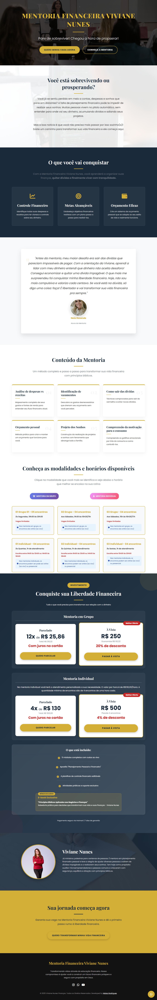

# Mentoria Financeira Viviane - Liberdade & Organização 💰📈

  

Este repositório contém o código-fonte da landing page oficial da mentora financeira **Viviane**. O projeto foi estruturado para servir como o hub principal de sua presença digital, focando na transformação da saúde financeira de seus clientes através de uma metodologia organizada e profissional.

## 🎯 Objetivo do Projeto
O foco central foi criar uma interface que gerasse confiança imediata. O design utiliza uma estética "premium" e clean, organizando as informações de forma que o usuário entenda o valor da mentoria antes mesmo de chegar ao botão de contato.

## 🚀 Tecnologias e Implementações
- **Frontend:** HTML5, CSS3 e JavaScript.
- **Branding Pessoal:** Layout otimizado para destacar a autoridade da mentora, com seções dedicadas à sua história e resultados.
- **UX para Consultoria:** Arquitetura de informação baseada em "quebra de objeções", respondendo as dúvidas mais comuns sobre mentoria financeira diretamente na página.
- **Conversão:** Botões de CTA (Call to Action) estratégicos para agendamento de sessões diagnósticas via WhatsApp.

## 📂 Funcionalidades
- **Metodologia de Mentoria:** Explicação clara das etapas do processo de acompanhamento financeiro.
- **Público-Alvo:** Seção focada em identificar as dores do cliente (endividamento, falta de organização, desejo de investir).
- **Proposta de Valor:** Destaque para os benefícios de longo prazo da mentoria.
- **Responsividade Total:** Interface fluida para dispositivos móveis, garantindo acesso rápido através de links na bio de redes sociais.

## 🌐 Link do Projeto
Veja a interface online: [amaple28.github.io/mentoria_financeira_viviane/](https://amaple28.github.io/mentoria_financeira_viviane/)

---
Desenvolvido por **Maisa Rodrigues**
